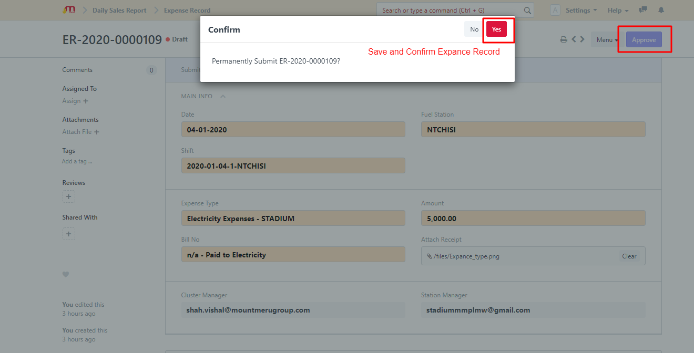
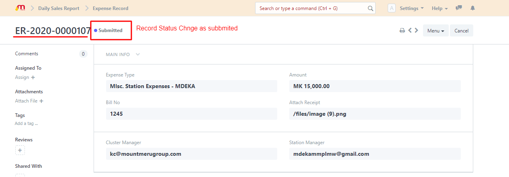

*Country Specifics* > Petty Expense > Section
# Section

Section means taracking each tranjection with approprate expance generate in which section or else which office that exapnce happns like Main Office, Sab branch office, wherehouse etc..
This allows you to maintain each expances separately, thereby limiting the overall maintenance on Accounting Dimension and what it will affect to yr stock accounts as well.
Cost Center and Project are treated as accounting dimensions by default in ERPNext. On setting a field in Accounting Dimension, that field will be added in transactions reports where applicable.

In ERPNext you can create configurable *Session* master and use them in transactions and reports.

To access the Section list, go to:

Home > County Specifics > Petty Expense > Section

*1. How to create Section in ERPNext.*

1. Go to the Section list and click on New.
2. Enter the name of the section (This name will appear in the transactions for which Section are created).
3. Company would be selected as we created our company for ERPNEXT.
4. Select the Business License Due Date and Workplace License Expiry Date.
5. Select the name of the Cost Center(This name will appear in the transactions for which cost center are created).
6. Select the name of Stock Adjustment Account (this name will apper in the transaction for which stock is affected)
7. Select the name of Default Cash Accoun (This name will apper in the transaction for which cash a/c you wanna reflact the amount of expance)
8. Select the name of Purchase Taxes and Charges Template (This name will apper in the transaction for puechase templated you created for company)
9. Default Warehouse would be selected as per which wherehouse will affect for specif expance as per stock 
10. Selct the name of Cash Customer which is provide the expance in cash select that customer 11. Select the name of Cash Customer POS Profile (which custome POS is already created into ERPNEXT system for particular transaction)
11. Set the Monthly Target as per your target and save the document

*Country Specifics* > Petty Expense > Expense Type
# Expense Type

An Expance type is an entry of which kind of expance has happn in to the company.

An Expance type shows any kind of expances like Repairs and Maintenance Motor Vehicle,Salary Local,Electricity Expenses and many more...

To access an Expance Type list, go to:
Home > County Specifics > Petty Expense > Expance Type

*1. How to create Expance Type in ERPNext.*

1. Go to the Expance Type list and click on New.
2. ter the name of the expance type (This name will appear in the transactions for which expance type are created).
3. Company name should be selected by default as we created comapny while set up erpnext for yr company.
4. Select the name of Fuel Station (This will show thw which are this expance would be accure )
5. Select the name of Expance Account (This entry will reflact in to account of direct or indirect expance )
6. check  Related to Oil Company if expanace type is relat to oil based company 
7. Save the Document

*Country Specifics* > Petty Expense > Expense Record

# Expense Record

 An expense record is record or entry of a transaction  as an outflow of money or assets to another individual or company as payment for an item or service.
 
 1. Prerequisites 
Before creating and using an expance record, it is advised that you create the following first:

- Section 
- Expance Type

To access an Expance Record list, go to:
Home > County Specifics > Petty Expense > Expance Record

*1 How to create Expance Record in ERPNext.*

1. Go to the Expance Record list and click on New
2. Select the name of Expense Type (This name will appear in the transactions for which expance Type are created)
3. Set the Expance amount of your expance
4. Enter the bill number which our company get the bill or receipt of expance
5. Attach the receipt or bill of image which you get from the expance u did for comapy
6. then save the expance record the approve it then submit the record while we subbmit the record in backgroung general entry happens which is link to this document.(General entry would we the expace against you spend the money and it will reflect to the general ledger)
7. Relode the document you will the the general Entey Created

